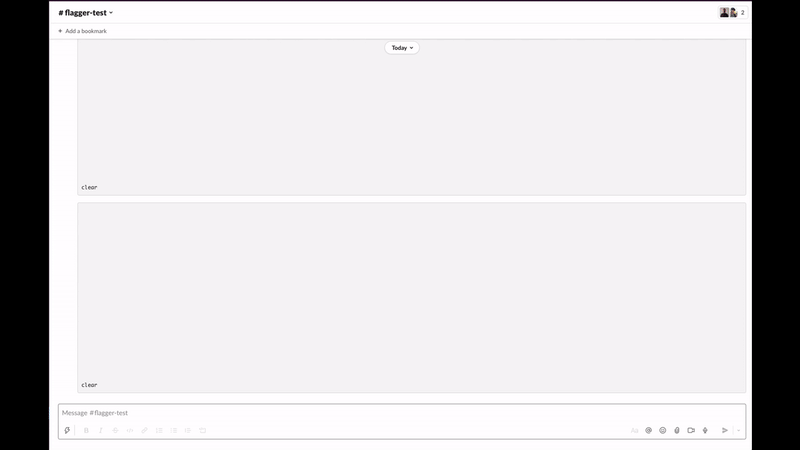

# flagger-k6-webhook

Using [k6](https://k6.io/) to do load testing of the canary before rolling out traffic

Here's a demo (sped up):



## Configuration

Here's what the `Canary` webhook can look like. This is `pre-rollout` webhook, so it happens before any traffic is placed on the canary. If the webhook passes the thresholds, the rest of the Flagger analysis and promotion process occurs

See the [k6 docs](https://k6.io/docs) for a full description of options available in scripts

```yaml
apiVersion: flagger.app/v1beta1
kind: Canary
...
spec:
  analysis:
    ...
    webhooks:
    - name: k6-load-test
      timeout: 5m
      type: pre-rollout
      url: http://<k6_loadtester_service_name>.<k6_loadtester_namespace>:<k6_loadtester_service_port>/launch-test
      metadata:
        script: |
          import http from 'k6/http';
          import { sleep } from 'k6';
          export const options = {
            vus: 2,
            duration: '30s',
            thresholds: {
                http_req_duration: ['p(95)<50']
            },
            ext: {
              loadimpact: {
                name: '<cluster>/<your_service>',
                projectID: <project id>, # Optional, will use the default project otherwise
              },
            },
          };

          export default function () {
            http.get('http://<your_service>-canary.<namespace>:<service_port>/');
            sleep(0.10);
          }
        upload_to_cloud: "true"
        slack_channels: "channel1,channel2"
        notification_context: "My Cluster: `dev-us-east-1`" # Additional context to be added to the end of messages
        min_failure_delay: "2m" # Fail all successive runs after a failure (keyed to the namespace + name + phase) within the given duration (defaults to 2m). This prevents reruns. Set this to a duration slightly above the testing interval
        wait_for_results: "true" # Wait until the K6 analysis is completed before returning. This is required to fail/succeed on thresholds (defaults to true)
        env_vars: "{\"KEY\": \"value\"}" # Injects additional environment variables at runtime
        kubernetes_secrets: "{\"TEST_VAR\": \"other-namespace/secret-name/secret-key\"}" # Injects additional environment variables from secrets, at runtime
```

### Injecting secrets and configuration

Use the [k6 environment variables feature](https://k6.io/docs/using-k6/environment-variables/) to inject configurations and secrets to your script. To do so, mount your configs as environment variables onto the load tester and reference them with `${__ENV.<VAR_NAME>}`

You can also refer to other secrets by using the `kubernetes_secrets` setting in metadata. This is useful if your secrets are not located in the same namespace as the load tester or if you wish to limit the amount of secret to mount to the load tester. Note that you will need to assign a Kubernetes service account that can read the secrets in question to the load tester deployment

### Using K6 Cloud

In order to send results to K6 cloud, the following conditions must be met:

1. The script itself must support it. As shown above, in the `ext.loadimpact`, your script must define a test name and, optionally, a project ID
2. You must pass the `upload_to_cloud: "true"` attribute in your Canary's metadata
3. A `K6_CLOUD_TOKEN` environment variable must be set on the load tester's deployment

Once all of this is setup, results will be [streamed to the cloud](https://k6.io/docs/results-visualization/cloud/)

## How to deploy

Deploy this as a Service + Deployment beside Flagger:

- Set the `K6_CLOUD_TOKEN` environment variable if any of your tests will be uploaded to [k6 cloud](https://k6.io/cloud/)
- Set the `SLACK_TOKEN` environment variable to allow slack updates

See [the example directory](./example) for a full example on how the loadtester can be deployed along with a Canary referencing it

## How to deploy using Helm

```
helm repo add flagger-k6-webhook https://grafana.github.io/flagger-k6-webhook 

helm upgrade -i k6-loadtester flagger-k6-webhook
--namespace=flagger
--set webhook.vars.K6_CLOUD_TOKEN=token
--set webhook.vars.SLACK_TOKEN=slack_token
```
